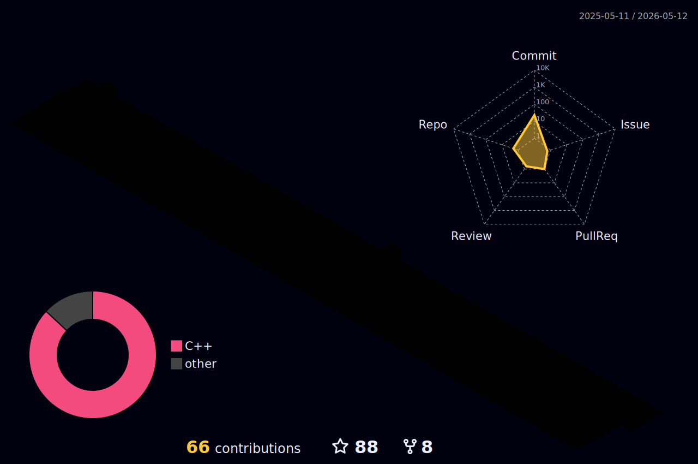

<h1 align="center">  👋 Hi, I'm Ethem MERÇ </h1>
<h4 align="center" > I'm a candidate Software Engineer, my "hello world" has been igniting since 2022 November 👨‍🎓 </h2>

## ⏲ What am i doing now:
- 🔭 I’m currently upgrade my skill about C && C++, Linux, Protocols 👩‍💻
- 🌎 2026 Goals : Learning to YOCTO, Embedded Systems, High Frequency Transfer 🆓🤖
- 👋 Fact: I love to search and learn new informations 🚀</h3>

### 📩 Connect with me:
[][linkedin]
[][gmail]
[][hackerrank]
[][stackoverflow]
 
</a>

### 💻 Languages and Tools (Learning and Using): 

[][C]
[][C++]
[][Bash]
[][C#]
[][mssql]
[][postgresql]
[][redis]
[][mongodb]
[][git]
[][linux]
[][ubuntu]
[][intellij]
[][clion]
[][vstudio]
[][sdr]
[][trello]
[][docker]

 
</a>

 

[linkedin]: https://www.linkedin.com/in/mercethem/
[hackerrank]: https://www.hackerrank.com/mercethem/
[stackoverflow]: https://stackoverflow.com/users/20124061/ethem-merc/
[gmail]: mailto:mercethem@gmail.com
[git]: https://git-scm.com/
[github]: https://github.com/mercethem
[clion]: https://www.jetbrains.com/clion/
[C]: https://en.cppreference.com/w/
[C++]: https://en.cppreference.com/w/
[C#]: [https://en.cppreference.com/w/](https://www.w3schools.com/cs/index.php)
[git]: https://git-scm.com/
[mssql]: https://www.microsoft.com/tr-tr/sql-server/sql-server-2019
[postgresql]: https://www.postgresql.org/
[redis]: https://redis.io/
[mongodb]: https://www.mongodb.com/
[neo4j]: https://neo4j.com/
[intellij]: https://www.jetbrains.com/idea/
[linux]: https://www.linux.org/
[ubuntu]: https://ubuntu.com/
[vstudio]: https://visualstudio.microsoft.com/
[sdr]: https://osmocom.org/projects/rtl-sdr/wiki/Rtl-sdr
[trello]: https://trello.com/
[docker]: https://www.docker.com/
[bash]: https://tiswww.case.edu/php/chet/bash/bashtop.html/

