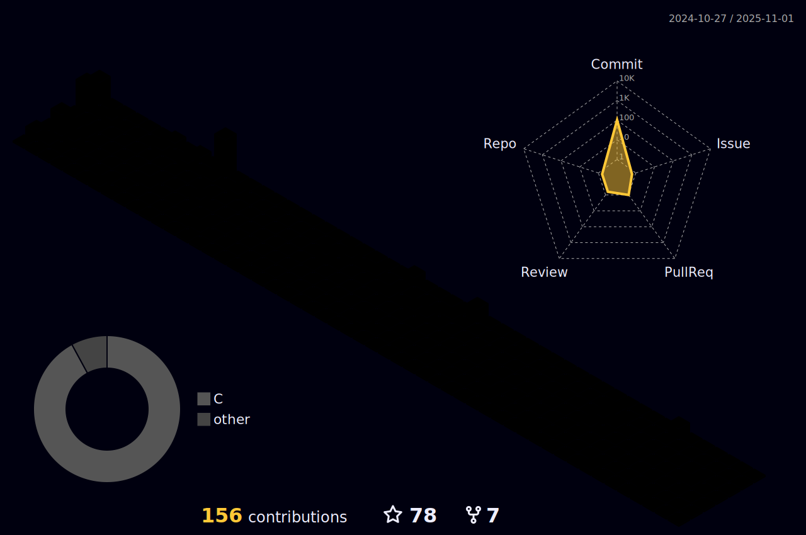

<h1 align="center">  👋 Hi, I'm Ethem MERÇ </h1>
<h4 align="center" > I'm a Student at Software Engineering and i have started codding in November 2022👨‍🎓 </h2>

## ⏲ What am i doing now:
- 🔭 I’m currently learning Algorithms, Data Structures, Communications Protocols, C, C++, Linux, Git, Clean Code 👩‍💻
- 🌎 2024 Goals : Learning to algorithms, developing C/C++, const correctness, improve problem solving ability, 
  developing and using tools 🆓🤖
- 👋 Fact: I love to search and learn new informations 🚀</h3>

### 📩 Connect with me:
[][linkedin]
[][gmail]
[][hackerrank]
[][stackoverflow]
 
</a>

### 💻 Languages and Tools (Learning and Using): 

[][java]
[][C]
[][C++]
[][mssql]
[][mysql]
[][git]
[][linux]
[][intellij]
[][clion]
[][vstudio]
 
</a>

 

[linkedin]: https://www.linkedin.com/in/mercethem/
[hackerrank]: https://www.hackerrank.com/mercethem/
[stackoverflow]: https://stackoverflow.com/users/20124061/ethem-merc/
[gmail]: mailto:mercethem@gmail.com
[git]: https://git-scm.com/
[github]: https://github.com/mercethem
[clion]: https://www.jetbrains.com/clion/
[C]: https://en.cppreference.com/w/
[C++]: https://en.cppreference.com/w/
[java]: https://www.java.com/en/
[git]: https://git-scm.com/
[mssql]: https://www.microsoft.com/tr-tr/sql-server/sql-server-2019
[mysql]: https://www.mysql.com/
[intellij]: https://www.jetbrains.com/idea/
[linux]: https://www.linux.org/
[vstudio]: https://visualstudio.microsoft.com/

--------------------------------------------------------------------------------------------------------------------------------------------------
> 😇: **DONATE**: Ziraat USD : TR62 0001 0015 6160 1223 7950 05 --- Ziraat TL  : TR29 0001 0000 1960 1223 7950 02
